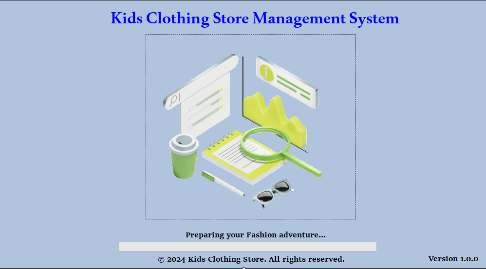
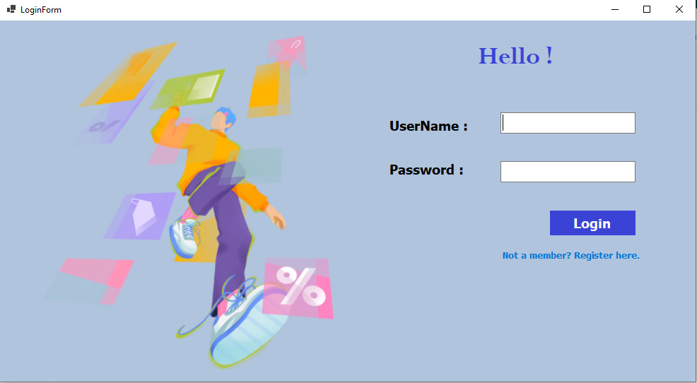
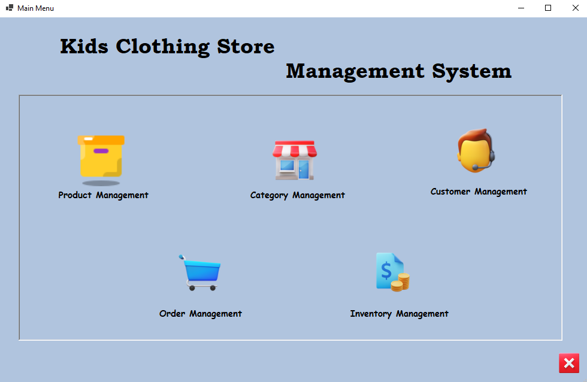
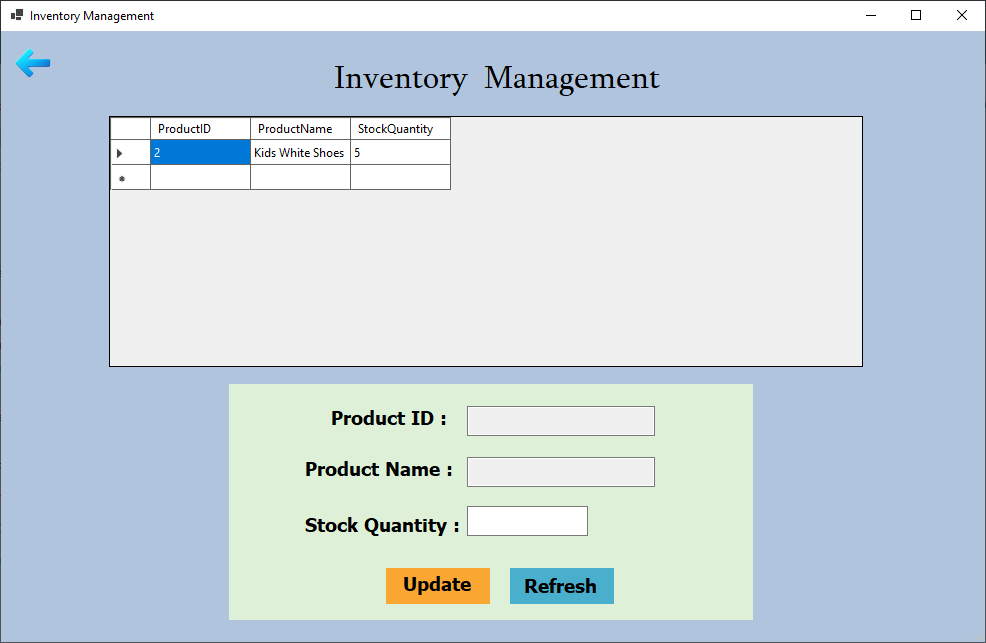
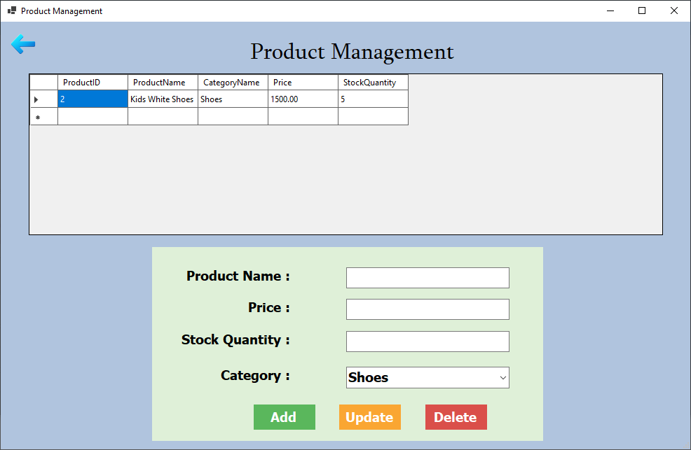
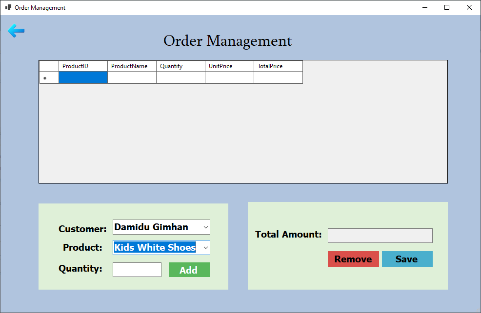

# Kids Clothing Store Management System

## Overview
The Kids Clothing Store Management System is a comprehensive software solution designed to streamline the operations of a children's clothing retail store. Built with VB.NET and MySQL, this system offers robust features for inventory management, sales processing, and customer relationship management.

## Features
- Product Catalog Management
- Inventory Tracking
- Product Management
- Customer Management
- User Role Management (Admin, Sales Staff)

## Technology Stack
- Frontend: VB.NET (Windows Forms)
- Backend: MySQL (WAMP Server)
- Database Script: `kidsclothingstore.sql`

## Setup Instructions
1. Clone this repository to your local machine.
2. Install WAMP Server and ensure MySQL service is running.
3. Open MySQL Workbench or phpMyAdmin and execute the `kidsclothingstore.sql` script to create the database and tables.
4. Open the project in Visual Studio.
5. Restore NuGet packages if necessary.
6. Update the database connection string in the application to match your MySQL setup.
7. Build and run the application.

## Screenshots

### Login Screen

### Main Dashboard

### Inventory Management

### Product Management

### Order Management

## Contributing
We welcome contributions to improve the Kids Clothing Store Management System. Please fork this repository and submit a pull request with your proposed changes.

## Author
- [Damidu Gimhan](https://github.com/DamiduGimhan20)

## License
This project is licensed under the MIT License.
